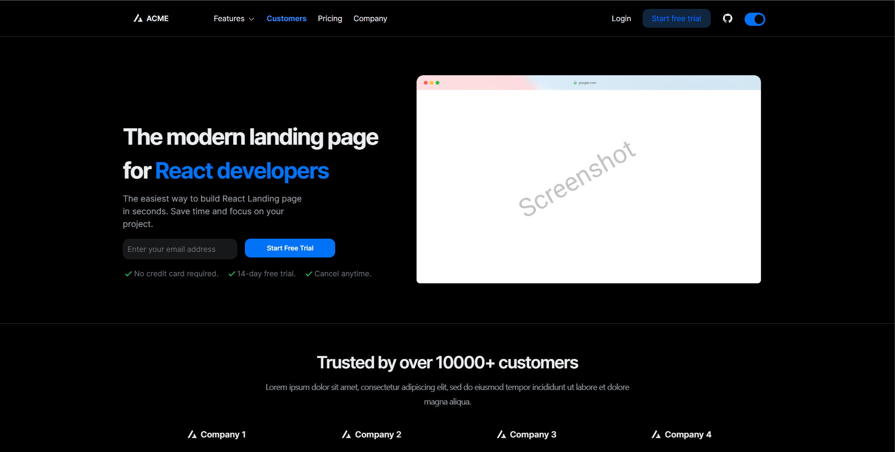

# 🚀 NextUI Landing Template

A modern, high-performance React landing page template built with [Next.js](https://nextjs.org) and [NextUI](https://nextui.org).

[](https://nextjs.org)
[](https://reactjs.org)
[](https://typescriptlang.org)
[](https://nextui.org)

[](https://vercel.com/import/project?template=https://github.com/Siumauricio/landing-template-nextui)

## ✨ Improvements Made

### 🚀 **Performance Enhancements**
- ⚡ Updated to Next.js 15.5.0 and React 19.1.1
- 🖼️ Next.js Image optimization with blur placeholders
- 📦 Dynamic imports for better code splitting
- 📊 Web Vitals monitoring integration
- 🔄 Lazy loading for non-critical components

### 🛠️ **Developer Experience**
- 📝 TypeScript 5.9.2 with strict mode
- 🔧 Path aliases for cleaner imports (@/components/*)
- 📋 Enhanced ESLint configuration
- 🎯 Better type safety throughout
- 📦 Updated to pnpm for faster installs

### 🔍 **SEO & Accessibility**
- 🎯 Custom SEO component with meta tags
- 🗺️ Auto-generated sitemap.xml
- 🤖 Dynamic robots.txt
- ♿ ARIA labels and accessibility improvements
- 📱 Open Graph and Twitter card optimization

### 🎨 **UI/UX Improvements**
- 🌙 Enhanced dark/light mode toggle
- 📱 Better responsive design
- 🎯 Interactive form states
- ⚡ Loading states for CTAs
- 🎨 Consistent design system

## 🚀 Quick Start

### Prerequisites
- Node.js 18.0.0 or later
- pnpm 8.0.0 or later (recommended)

### Installation

```bash
# Clone the repository
git clone <repo-url>
cd landing-template-nextui-main

# Install dependencies
pnpm install

# Set up environment (optional)
cp .env.local.example .env.local

# Start development server
pnpm dev
```

Open [http://localhost:3000](http://localhost:3000) to view the application.

## 📝 Available Scripts

```bash
pnpm dev           # Start development server
pnpm build         # Build for production
pnpm start         # Start production server
pnpm lint          # Run ESLint
pnpm lint:fix      # Fix ESLint errors
pnpm type-check    # TypeScript type checking
```

## 📄 Features Included

### 🏠 **Landing Page Sections**
- ⭐ Hero Section with email capture
- 🏢 Trusted Companies showcase
- ⚡ Three different Features sections
- 💬 Testimonials carousel
- 📊 Statistics display
- 💰 Pricing plans comparison
- ❓ FAQ accordion
- 🎯 Call-to-action section
- 📞 Footer with links

### 🎯 **Technical Features**
- 🌙 Dark/Light mode support
- 📱 Fully responsive design
- ♿ Accessibility compliant
- 🔍 SEO optimized
- 📊 Performance monitoring
- 🚀 Fast loading times

## 🖼️ Screenshots

### Dark Mode


### Light Mode  


## 🤝 Contributing

Contributions are welcome! Please feel free to submit a Pull Request or open an Issue:

- [Issues](https://github.com/Siumauricio/landing-template-nextui/issues)
- [Pull Requests](https://github.com/Siumauricio/landing-template-nextui/pulls)

## 📄 License

This project is open source and available under the MIT License.

---

<div align="center">

**Made with ❤️ using Next.js and NextUI**

</div>
